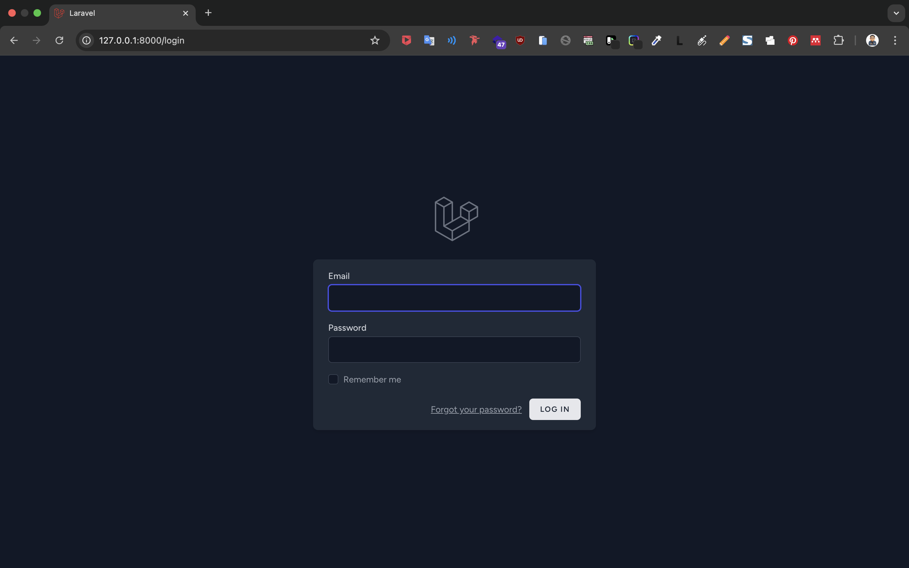
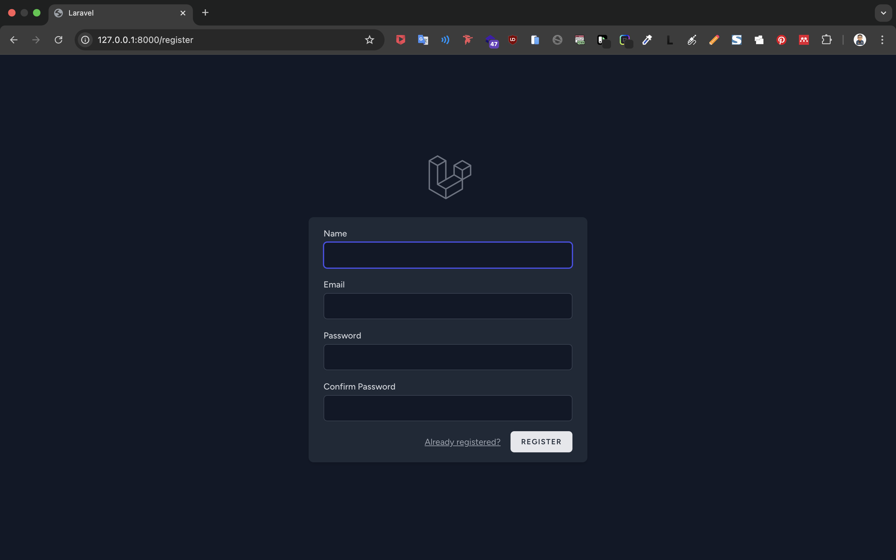
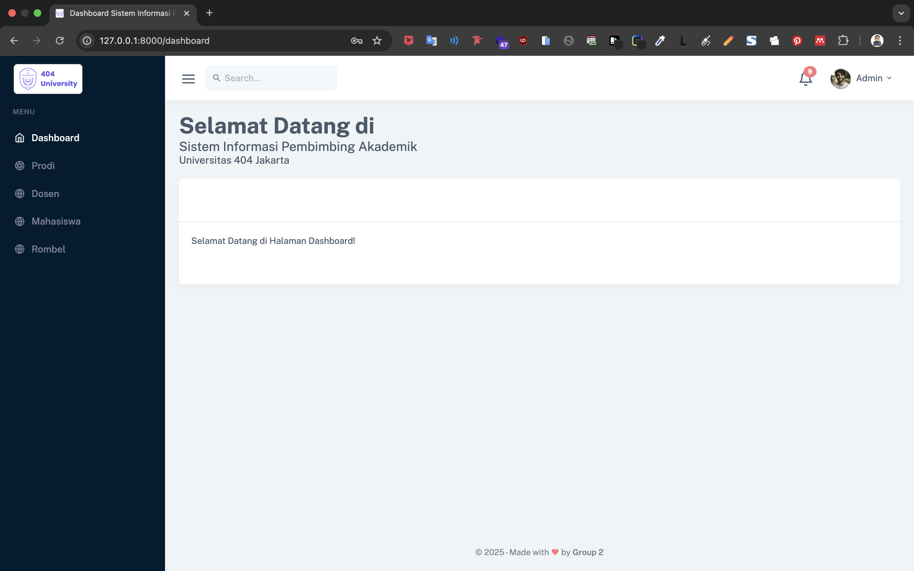
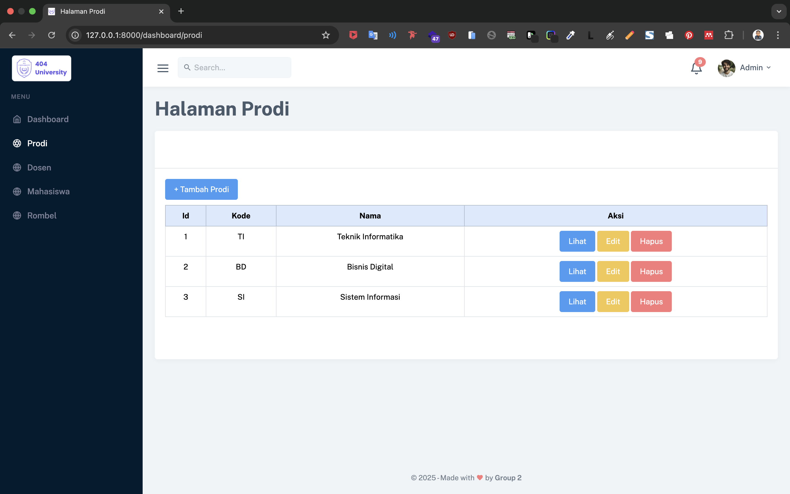
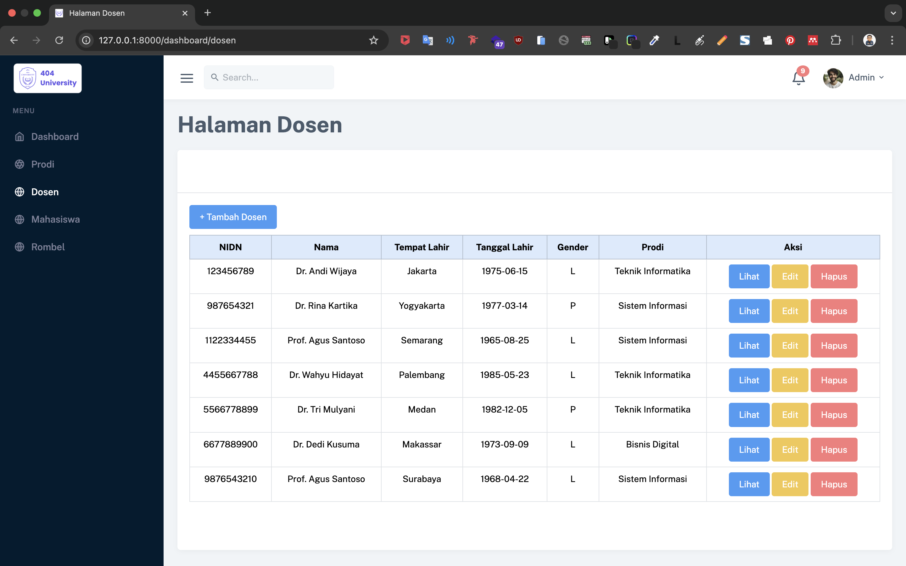
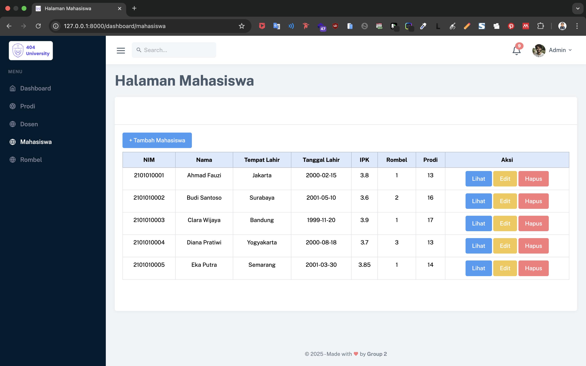
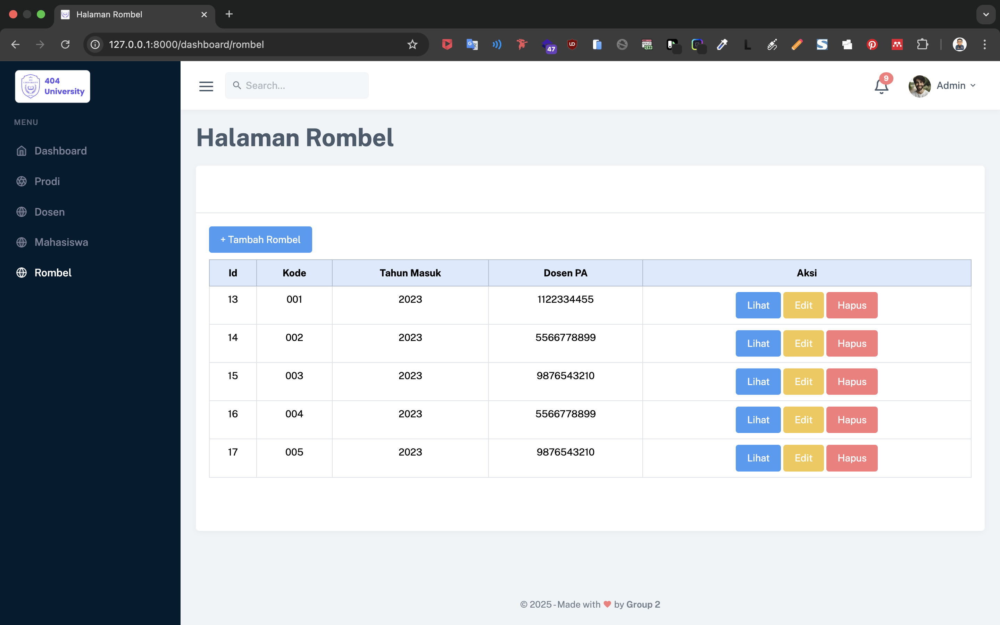

# 🎓 Pembimbing Akademik Kampus

Website **Pembimbing Akademik Kampus** adalah platform manajemen yang secara **khusus berfokus pada pengelolaan dan pendataan mahasiswa berdasarkan program studi (prodi) dan rombongan belajar (rombel)**, serta **penugasan Dosen Pembimbing Akademik (PA)** untuk setiap mahasiswa.

Sistem ini memberikan kendali penuh kepada **admin** untuk mengelola data dasar seperti prodi, daftar dosen, data mahasiswa, dan rombel, termasuk menetapkan serta memperbarui relasi antara mahasiswa dengan prodi, rombel, dan dosen PA. Tujuan utamanya adalah menyediakan **database terstruktur dan terpusat** untuk informasi akademik penting.

---

## ✨ Fitur Utama

- 🏠 **Landing Page**: Halaman utama yang informatif untuk pengunjung.
- 📊 **Dashboard Berbasis Role**:
  - 👨‍💼 **Admin**: Manajemen penuh data prodi, dosen, mahasiswa, rombel, dan penugasan PA.
  - 👨‍🏫 **Dosen**: Melihat daftar mahasiswa yang dibimbing beserta detailnya.
  - 👨‍🎓 **Mahasiswa**: Melihat informasi Dosen PA, prodi, dan rombel mereka.
- 🗃️ **CRUD** (Create, Read, Update, Delete):
  - Prodi
  - Dosen
  - Mahasiswa
  - Rombel
- 🔐 **Sistem Otentikasi**: Login & Register aman sesuai role.

---

## 🛠 Teknologi yang Digunakan

- ⚙️ **PHP Laravel** – Backend framework powerful
- 🎨 **CSS Bootstrap** – Frontend framework responsif
- 🛢 **MySQL** – Sistem manajemen basis data relasional

---

## 🚀 Instalasi & Setup

Ikuti langkah-langkah berikut untuk menjalankan proyek ini secara lokal:

1. **Clone Repository**:
    ```bash
    git clone https://github.com/achmadrmdhn/pembimbing-akademik-kampus.git
    cd pembimbing-akademik-kampus
    ```

2. **Install Dependency Laravel**:
    ```bash
    composer install
    ```

3. **Salin File .env**:
    ```bash
    cp .env.example .env
    ```

4. **Generate App Key**:
    ```bash
    php artisan key:generate
    ```

5. **Konfigurasi Database di `.env`**:
    ```dotenv
    DB_CONNECTION=mysql
    DB_HOST=127.0.0.1
    DB_PORT=3306
    DB_DATABASE=pembimbing_akademik
    DB_USERNAME=root
    DB_PASSWORD=
    ```

6. **Jalankan Migrasi**:
    ```bash
    php artisan migrate
    ```

7. **Seeder (Opsional)**:
    ```bash
    php artisan db:seed
    ```

8. **Jalankan Aplikasi**:
    ```bash
    php artisan serve
    ```
    Akses melalui: [http://127.0.0.1:8000](http://127.0.0.1:8000)

---

## 🧪 Contoh Penggunaan

Berikut beberapa langkah dan tampilan antarmuka pengguna:

### 1. Landing Page


### 2. Halaman Login


### 3. Halaman Register


### 4. Dashboard Utama


### 5. CRUD Data Prodi


### 6. CRUD Data Dosen


### 7. CRUD Data Mahasiswa


### 8. CRUD Data Rombel


---

## 👨‍💻 Kontributor

Proyek ini dikembangkan oleh:

- 📸 **Instagram**: [@rifairmdhnn_](https://instagram.com/rifairmdhnn_)
- 💼 **LinkedIn**: [Achmad Rifa'i Ramadhan](https://www.linkedin.com/in/achmadrifairamadhan/)

---

## ☕ Dukung Kami

Jika proyek ini bermanfaat bagi Anda, dukung pengembangannya melalui:

- ☕ [Buy Me a Coffee](https://lynk.id/rifairmdhnn_)

---

## 📄 Lisensi

Proyek ini dilisensikan di bawah [MIT License](LICENSE).

---

